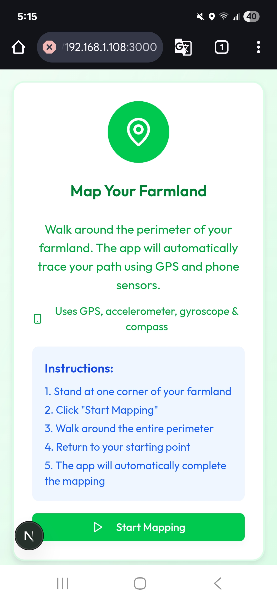
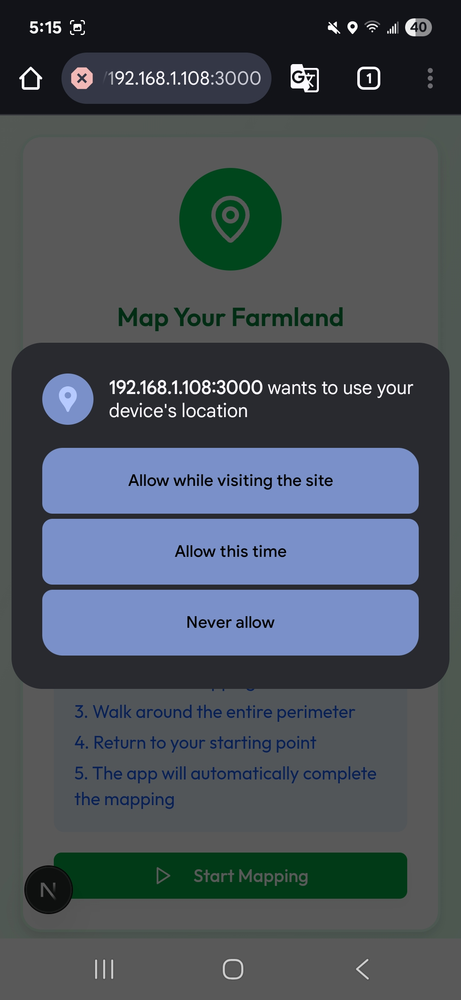
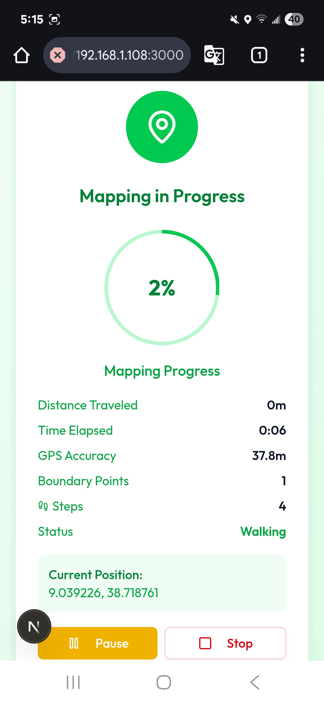

# 🌾 AgriLo - AI-Powered Smart Agriculture Assistant

## 📋 Problem Statement

Over **60% of Africa's population** relies on agriculture, yet most **smallholder farmers, especially women**, lack access to timely, localized data. A **2024 CGIAR review** found that farmers in Sub-Saharan Africa face severe gaps in **real-time weather and soil data**, and over **70% of digital solutions are fragmented**, offering raw numbers instead of clear guidance.

Generic platforms often ignore **local languages, customs, and agro-ecological needs**, making them ineffective. For example, **women farmers, who make up nearly 50% of the agricultural labor force**, are disproportionately affected by poor access to tailored, actionable insights. Without an integrated, user-friendly system, millions remain vulnerable to **climate shocks, low yields, and inefficient resource use**.

## 🎯 The idea (Our solution)

**AgriLo** is an **AI-powered smart agriculture assistant** designed to support **smallholder farmers, especially women in Sub-Saharan Africa and beyond**. Built using the **OpenEPI ecosystem of APIs**, AgriLo combines **real-time weather forecasts, soil data, and crop health diagnostics** to provide personalized recommendations, intelligent scheduling, and actionable plans tailored to each farmer's land.

With support for **natural language in multiple local languages**, AgriLo is designed to be accessible and user-friendly, especially for communities often excluded from tech solutions.

No more bulky charts, confusing dashboards, or inaccessible apps, AgriLo brings **smart farming insights straight to the farmer's fingertips** through a simple, conversational interface.

## 🚀 Key Features:

### 1) **Recommendations** to improve yield and productivity
- **Fertilizer recommendation system**
- **Crop recommendation**

### 2) **AI-powered task scheduling** that helps prevent losses by:
- **Checking weather forecasts** to plan irrigation and harvesting
- **Recommending the right time** to apply fertilizers
- **Creating weekly action plans** (e.g., "Irrigate Monday", "Fertilize Wednesday") based on crop stage and weather

### 3) 🩺 **Monitoring & Diagnosis**
Our system enables real-time **plant health diagnosis** using photos or live image capture. It supports **700+ plant diseases** across **38 crop species** and offers:
- **Representative images** of affected crops
- **Clear treatment instructions**
- **Disease symptoms and severity levels**
- **Treatment history and future prevention tips**
- **AI-powered chatbot** for personalized guidance and support

### 4) **AI/Voice chat interaction**
Our AI assistant supports live chat and voice-based interaction, making it easy to get help hands-free. It currently understands multiple languages, including **English, Swahili, Indonesian, Amharic, and Norwegian**. By supporting both text and audio communication, we ensure farmers can interact in the way that's most comfortable for them and in a language they understand

## 👥 Who it benefits:

### **Small Scale Farmers**
This web app is especially targeted for **small scale farmers** who use traditional farming methods which do not depend on data. This app can provide a full plan that is easily used in the farming process until the crop is harvested.

### **Large Enterprise Farms**
This app can also be used to manage and plan **enterprise grade farms** that might be difficult to manage without digital management means.

## How It Works / Hands-On with the Production

To explore the web app, visit this link:  
[https://agri-smart-pi.vercel.app](https://agri-smart-pi.vercel.app)  

Follow this guideline document to navigate the web app effectively:  
[User Guide](https://docs.google.com/document/d/e/2PACX-1vRU3JepnuOAvJMDdPzwCaxM81nuttMNrVpFQouQnxJzOCtis7a6e9AqmPD9el67K6Tjlq-_NqCqyd3C/pub)


## 🚀 Further technical development/scale (already started)

We tried to implement a user-friendly approach for farmers to input their land boundaries. This is a **GPS-based land mapping feature** that uses the phone's sensors to automatically trace the farmland perimeter, area and location. So no need for map drawing on the phone. But we faced a time shortage for the integration of the system to the current project. So we have a plan to continue in the integration of this important feature, but it is still accessible for testing in the `location_setter` branch in the GitHub. (Screenshot of the implementation test is available.)

<table>
  <tr>
    <td></td>
       <td>
</td>
    <td></td>
   
  </tr>
</table>


- **Include SMS and USSD methods** to deliver data to farmers who do not have access to the internet or do not use a smartphone.
- We planned to design **Symbolic AI** – so that our app would provide real accurate data. Since AI models are generic and sensitive to error margin
- We managed to test an AI model that can run offline without any internet access that can answer and chat with the farmers in agriculture. So in future we plan to design an app so that farmers can interact with our app without any internet bundle.

**Test Model:**      **Ollama run sike_aditya/AgriLlama**
This model can give suggestions on the disease of the plant and some agricultural advice. But we aim to have more robust AI that is an agricultural specialist, so we might need more resources to fine-tune another base model using agricultural datasets, and we plan to use **tensorflow lite** to minimize and quantize the size and complexity of the fine-tuned model. (We have tested on the **tensorflow lite** method and it is promising, for testing the **tensorflow-lite-test** branch.) For now, we decided to stick with **Gemini**.

**Colab Link** that we experimented on tensorflow lite: 
https://colab.research.google.com/drive/158-rip9q8HwslSV-YDm83DNo37E9L37x?usp=sharing

By using **AI agent** we can utilize automation so that the farmer schedule just by ai chat instruction, which it provides weekly report on the field

## 🔮 Further (Special) Feature development

Connect with **NGOs and Agricultural Financial advisors** so that we can empower small-scaled farmers to achieve their economic stability.

We plan to add one more feature called **"MarketPlace"**, it is where farmers receive contracts from government, and private companies, allowing them to sell their crops at fair price and market demand.

## 🛠️ Used Technology:

**NextJs (Frontend)**

**FastAPI (Backend)**

**Pydantic (Data Validation)**

**Postgres (Database)**

**Gemini (AI)**

**Figma (Design)**

**Material Design/Symbol and Google Font (Design)**

## 🔌 APIs and Resources Used

We integrated several APIs to support smart, data-driven decisions in our project, with a strong focus on agricultural insights. Our primary API is the **OpenEPI API**, which we complemented with additional APIs to enrich functionality:

**Soil Recommendations**
 ```bash
   iSDA Soil API** (via OpenEPI)
   SoilGrids API** (via OpenEPI)
   
   ```
**Geocoding**
 ```bash
   OpenEPI Geocoding API** (via OpenEPI)
   
   ```
**Crop Health Diagnosis**
 ```bash
 OpenEPI Crop Health Model API** (via OpenEPI)
Deepleaf API
Kindwise API  
   ```
**Weather Forecasting**
 ```bash
OpenMetro Weather API
   ```


🔧 **Additional Tools and Services**

**Google Cloud Translation API** – for multilingual support

**Google Cloud Text-to-Speech (TTS)** – to assist low-literacy users

**Google Maps API** – for farmland mapping

## 🚀 How to Run the Project

### Backend Setup

1. **Navigate to backend directory:**
   ```bash
   cd backend
   ```

2. **Create and activate virtual environment:**
   ```bash
   python -m venv venv
   # On Windows:
   venv\Scripts\activate
   # On macOS/Linux:
   source venv/bin/activate
   ```

3. **Install dependencies:**
   ```bash
   poetry install
   ```

3. **Run the FastAPI server:**
   ```bash
   uvicorn src.main:app --reload
   ```

4. **Access the API documentation:**
   - Open your browser and go to: `http://127.0.0.1:8000/docs`
   - This will show the interactive API documentation

### Frontend Setup

1. **Navigate to frontend directory:**
   ```bash
   cd frontend
   ```

2. **Install dependencies:**
   ```bash
   npm install
   ```

3. **Run the development server:**
   ```bash
   npm run dev
   ```

4. **Access the application:**
   - Open your browser and go to: `http://localhost:3000`
   - The AgriLo application will be running


### Environment Variables

To run this project, you need to set up the following environment variables:

```bash
# API Keys
KINDWISE_API_KEY=your_kindwise_api_key_here
GOOGLE_API_KEY=your_google_api_key_here
DEEPL_API_KEY=your_deepl_api_key_here
TAVILY_API_KEY=your_tavily_api_key_here
DETECT_LANGUAGE_API=your_detect_language_api_key_here
GOOGLE_MAPS_API_KEY=your_google_maps_api_key_here

# Database Credentials
ISDA_USERNAME=your_isda_username_here
ISDA_PASSWORD=your_isda_password_here

# Security
JWT_SECRET_KEY=your_jwt_secret_key_here

# Google Cloud Platform
GCP_CREDENTIALS_B64=your_base64_encoded_gcp_credentials_here
```

**Note:** Create a `.env` file in the backend directory and add these environment variables with your actual API keys and credentials.

### Prerequisites

- **Node.js** (v16 or higher)
- **Python** (v3.8 or higher)
- **Poetry** (for backend dependency management)
- **Git** (for cloning the repository)
